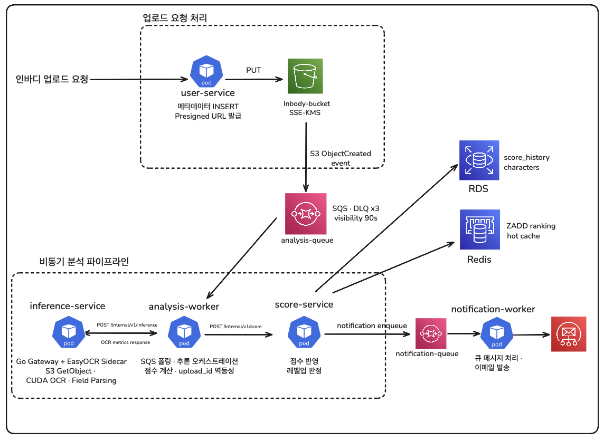

# BodyBuddy
<p align="center">
  
</p>

> 인바디 결과를 점수화해 캐릭터를 키우는 헬스 서비스 — AWS EKS 위에서 비동기 MSA를 운영하며 GitOps, 관측성, progressive delivery, GPU 추론 워크로드, Spot 비용 최적화, DR을 실제 증거로 검증한 클라우드 인프라 프로젝트입니다

## 메인 아키텍처


### 인바디 업로드 비동기 처리 흐름



<p align="center"><em>user-service는 presigned URL만 발급하고, 실제 이미지 PUT은 클라이언트가 S3에 직접 수행한다.</em></p>

### 워크로드 배치

| Workload | NodePool | Capacity | Reason |
|---|---|---|---|
| `user-service` | `critical-pool` | on-demand | user-facing API, lower latency sensitivity |
| `score-service` | `critical-pool` | on-demand | ranking/read API, HPA target |
| `analysis-worker` | `batch-pool` | spot | async processing, retryable with SQS |
| `inference-service` | `gpu-pool` | on-demand GPU | EasyOCR/CUDA 추론, CPU 워크로드와 장애·비용 격리 |
| `notification-worker` | `batch-pool` | spot | async notification, delay-tolerant |

---

## What This Project Proves

| 영역 | 구현 내용 | 검증 증거 |
|---|---|---|
| MSA on EKS | Go 기반 API·worker·inference gateway 5개를 EKS에 배포 | ArgoCD 전체 `Synced Healthy`, 서비스별 readiness 확인 |
| GitOps | ArgoCD App-of-Apps로 Helm chart 관리 | Git 변경 후 자동 sync, self-heal 운영 |
| 비동기 처리 | `S3 -> SQS -> analysis-worker -> inference-service -> score-service` 흐름 | 실제 이미지 업로드 후 OCR·score 반영, queue/DLQ `0` |
| GPU 추론 운영 | EasyOCR runtime을 GPU 전용 NodePool에 격리하고 scale-to-zero 적용 | Tesla T4 실제 추론, GPU 사용률 최대 `81%`, 노드 자동 회수 |
| Progressive Delivery | Argo Rollouts와 Prometheus 분석 게이트로 canary 배포 | 정상 버전 자동 승격, p95 기준 위반 버전 자동 abort |
| Spot 운영 | API는 on-demand, worker는 Spot 노드로 분리 | Spot 노드 drain, re-queue, 새 worker 재처리 |
| DR | S3 자동 복구, RDS PITR, 복구 런북 | Lambda 로그, RDS restore, RTO/RPO 매트릭스 |
| 관측성 / 오토스케일링 | OTel·Prometheus·Grafana·DCGM과 KEDA/HPA로 병목 관찰 | queue backlog `8,816`, worker `1 -> 12`, 8-span GPU trace |

---

## DR

현재 BodyBuddy에 구현한 복구 전략은 세 가지다. Kubernetes와 ArgoCD는 Pod/Deployment 삭제 시 선언형 상태를 기준으로 서비스를 다시 복구하고, batch 워커는 SQS 메시지를 성공 시에만 삭제하도록 구성해 interruption 이후에도 다른 worker가 메시지를 재처리할 수 있다. 여기에 `upload_id` 기반 멱등성 처리를 더해 동일한 분석 결과가 다시 들어와도 중복 반영되지 않게 했다.

| 장애 유형 | 구현 방식 | 현재 보장하는 것 |
|---|---|---|
| Pod / Deployment 삭제 | ReplicaSet + ArgoCD self-heal | 서비스 프로세스 자동 재생성, desired state 복구 |
| Spot / worker 종료 | SIGTERM graceful shutdown + SQS 재노출 | 신규 polling 중단, in-flight 처리 후 종료, 다른 worker 재처리 |
| S3 객체 삭제 | Versioning + Object Lock + EventBridge + Lambda | 최신 delete marker 제거, 이전 버전 자동 복원, 메일/대시보드 기록 |

### Spot 중단 시 Worker 재처리 흐름


Batch worker는 Spot 노드에서 실행하지만, SQS visibility timeout과 멱등성 처리로 interruption 이후에도 메시지 유실 없이 안전하게 재처리할 수 있도록 설계했다.

Core log:

```text
context cancelled during mock OCR sleep, re-queuing message
shutdown signal received, stopping polling loop
all in-flight messages processed
```

### S3 백업 / 복구


S3 객체 삭제 이벤트는 EventBridge와 Lambda로 연결하고, 최신 delete marker를 제거해 이전 버전을 다시 현재 버전으로 복원한다. 복구 결과는 SES 메일과 Grafana 대시보드로 함께 남겨 운영자가 삭제 감지 시점의 상태와 복구 성공 여부를 바로 확인할 수 있게 했다.

<div align="center">
  
  &nbsp;
  
</div>
<p align="center"><em>자동 복구 알림 메일 &nbsp;&nbsp;&nbsp; DR 대시보드</em></p>

메일에는 삭제 비율, 임계값, 삭제 마커 수, 복구 결과를 요약했고, 대시보드에는 자동 복구 호출 수, 복구된 객체 수, 실패 수, 복구 전 삭제 비율을 시각화했다.

### RDS PITR

| Scenario | Result |
|---|---|
| S3 object delete | Lambda가 delete marker를 제거해 약 `1.247s`에 자동 복구 |
| RDS data loss | PITR restore로 새 DB 인스턴스 `available` 도달 확인 |
| Recovery matrix | RTO/RPO 목표와 실측값을 표로 정리 |

---

## 관측성

kube-prometheus-stack으로 Prometheus + Grafana를 올리고 CloudWatch 데이터소스를 연결했다. 서비스 RED 메트릭과 DR 지표뿐 아니라 DCGM exporter의 GPU 사용률·메모리, inference 요청 수·지연을 같은 시간축에서 확인할 수 있도록 구성했다.


### OpenTelemetry Critical Path Trace

OpenTelemetry와 Tempo를 이용해 `analysis-worker -> inference-service -> OCR runtime -> score-service`로 이어지는 분석 크리티컬 패스를 실제 trace로 검증했다. S3 `ObjectCreated` 이벤트는 upstream trace context를 전달하지 않기 때문에, 비동기 소비 구간의 trace root는 `analysis-worker`에서 시작한다. 따라서 `user-service`까지 하나의 연속 trace로 보인다고 과장하지 않고, 이벤트 전후를 별도 trace와 비즈니스 식별자로 연결한다.

#### 1. Node Graph


Node graph는 `analysis-worker`가 GPU 추론을 위해 `inference-service`를 호출하고, 결과를 `score-service`에 반영하는 관계를 서비스 단위로 보여준다. 비동기 이벤트 이후의 내부 호출 경계가 올바르게 전파되는지 확인하는 데 사용한다.

#### 2. Waterfall Trace


Waterfall 화면에서는 전체 처리 시간 `916.6ms` 중 `inference-service`가 `850.6ms`, OCR runtime 호출이 `704.7ms`를 차지한 것을 확인했다. 반면 `score-service` 내부 처리는 `47.2ms`, DB 반영은 `4.9ms`로 나타나 병목이 DB가 아니라 모델 추론 경로임을 분해해 설명할 수 있었다.

#### 3. Span Details


Span detail에서는 worker의 inference/score outbound 요청, `inference-service /internal/v1/inference`, OCR runtime 호출, `score-service /internal/v1/score`, DB 저장과 notification enqueue까지 총 8개 span을 확인했다. 서비스 전체 지연을 애플리케이션·모델·DB·메시징 구간으로 나눠 판단할 수 있도록 구성했다.

---

## GPU 추론 워크로드

OCR을 `analysis-worker` 내부의 mock 처리로 남겨두지 않고, Go 기반 `inference-service`와 Python EasyOCR runtime으로 분리했다. API와 batch worker가 사용하는 CPU 노드와 GPU 추론 노드의 스케줄링·장애·비용을 격리하고, 모델 학습보다 **GPU 워크로드를 Kubernetes에서 안전하게 운영하고 관측하는 과정**에 초점을 맞췄다.

| 항목 | 구현 및 실측 결과 |
|---|---|
| GPU 배치 | Karpenter `gpu-pool`, `g4dn.xlarge` on-demand, Tesla T4 |
| 스케줄링 | `workload-type=gpu` taint/toleration과 `nvidia.com/gpu: 1` 요청 |
| 실제 추론 | EasyOCR 1.7.2 한국어·영어 모델, OCR model duration `435ms` |
| End-to-end | analysis 전체 `916.6ms`, inference span `850.6ms`, score `74` 반영 |
| GPU 관측성 | 성공 `46건`, 실패 `0건`, 최대 사용률 `81%`, 메모리 `1,284MiB` |
| 장애 격리 | inference 연결 실패 시 deterministic mock fallback, queue/DLQ `0` |
| 비용 회수 | 평상시 replica `0`, scale-down 후 약 5분 만에 GPU 노드 회수 시작 |

GPU 서비스 장애를 숨기지 않고 로그와 메트릭에는 failure/fallback으로 남기되, 비동기 파이프라인 전체가 중단되거나 메시지가 DLQ로 이동하지 않도록 설계했다. 드릴 때만 replica를 `1`로 올리고 종료 직후 `0`으로 내려, 고비용 GPU 노드가 상시 실행되지 않게 했다.

- [GPU Inference Workload MVP Report](./bodybuddy-infra/reports/gpu-inference-mvp.md)

---

## Release Engineering

`score-service`는 단순 rolling update 대신 Argo Rollouts canary 전략을 선택했다. 배포 성공을 Pod `Running` 상태가 아니라 실제 `/api/v1/ranking` 요청의 오류율과 p95 지연이 기준을 통과한 상태로 정의하고, Prometheus `AnalysisTemplate`을 승격 게이트로 사용했다.

| 단계 | 판단 기준 | 실제 검증 |
|---|---|---|
| `25%` canary | 30초 pause 후 error rate·p95 분석 | error `0`, p95 약 `4.91ms`, `Successful` |
| `50%` canary | 동일 분석을 한 번 더 수행 | error `0`, p95 약 `4.8ms`, `Successful` |
| 정상 승격 | 두 분석 게이트 통과 | Rollout `Healthy`, stable/current hash 일치 |
| 실패 주입 | p95 기준을 의도적으로 `0.1ms`로 강화 | p95 `4.75ms`, AnalysisRun `Failed` |
| 자동 중단 | 분석 실패 시 신규 버전 승격 금지 | Rollout `Degraded / abort`, stable 버전 계속 serving |

ArgoCD는 desired state 동기화를, Argo Rollouts는 배포 단계와 품질 판단을 담당하도록 책임을 분리했다. 기존 HPA도 Rollout 리소스를 scale target으로 전환해 오토스케일링과 progressive delivery가 함께 동작하도록 구성했다.

- [Release Engineering with Argo Rollouts](./bodybuddy-infra/reports/release-engineering-rollouts.md)

---

## LitmusChaos Dev Drill

LitmusChaos는 BodyBuddy에서 상시 플랫폼으로 운영하지 않고, **dev 환경에서 복원력 증거를 남기기 위한 일회성 장애 주입 도구**로 사용했다. 이번 1차 실험은 `analysis-worker`에 `pod-delete` fault를 주입해 Kubernetes self-healing, SQS 기반 비동기 재처리, 그리고 복구 이후 score 반영 정상 동작을 함께 검증하는 데 초점을 맞췄다.

### Drill Summary

| Item | Result |
|---|---|
| Target | `analysis-worker` deployment |
| Fault | LitmusChaos `pod-delete` |
| Litmus verdict | `Completed / Pass` |
| Worker replicas | `1 -> 0 -> 1` |
| Pod lifecycle | `Terminating -> Pending -> ContainerCreating -> Running` |
| Analysis queue depth | `0` 유지 |
| Analysis DLQ depth | `0` 유지 |
| Post-recovery score check | 정상 반영 확인 |

### What It Proved

- 장애 주입 시 `analysis-worker`가 실제로 종료되고 새 Pod가 재생성됨
- `Ready Replicas` 패널에서 worker 가용성이 `1 -> 0 -> 1`로 회복됨
- 복구 직후 CPU usage spike를 통해 새 worker가 다시 처리를 시작했음을 확인
- Queue / DLQ가 0을 유지해 짧은 장애 구간 동안 메시지 유실이나 backlog 누적 없이 복구됐음을 검증

### Evidence

<details>
<summary><strong>Drill 1 캡처 펼쳐보기</strong></summary>
<br />

<div align="center">
  
  &nbsp;
  
  &nbsp;
  
</div>
<p align="center"><em>ChaosResult Pass &nbsp;&nbsp;&nbsp; Pod 재생성 &nbsp;&nbsp;&nbsp; Ready Replicas 1 -> 0 -> 1</em></p>

</details>

이 실험은 “Pod가 다시 떴다” 수준이 아니라, **장애 주입 -> 가용성 하락 -> 복구 -> 처리 재개**를 Grafana와 Litmus 결과로 함께 확인했다는 점에서 의미가 있다. 이후 동일한 방식으로 `score-service pod-delete`, worker-to-service latency 같은 drill도 확장할 수 있다.

### Drill 2: `score-service` Pod Delete

2차 실험은 동기 API 의존성을 가진 `score-service`를 대상으로 `pod-delete` fault를 주입해, Kubernetes self-healing과 서비스 복구 과정을 검증하는 데 초점을 맞췄다. `analysis-worker` drill이 비동기 재처리와 queue 안정성을 증명했다면, 이번 실험은 **내부 API 의존 서비스가 죽었을 때도 deployment 수준에서 자동 복구가 정상 동작하는가**를 확인하는 단계였다.

#### Drill Summary

| Item | Result |
|---|---|
| Target | `score-service` deployment |
| Fault | LitmusChaos `pod-delete` |
| Litmus verdict | `Completed / Pass` |
| Score-service replicas | `1 -> 0 -> 1` |
| Pod lifecycle | `Terminating -> Pending -> ContainerCreating -> Running` |
| Ranking read latency panel | 의미 있는 변화 없음 |
| Recovery check | 새 Pod가 `Running/Ready`로 복귀 확인 |

#### What It Proved

- `score-service` 단일 Pod를 강제로 종료해도 Deployment가 새 Pod를 즉시 재생성함
- `Ready Replicas` 패널에서 `1 -> 0 -> 1` 복구 흐름이 관측됨
- Pod 재생성 중 `Pending -> ContainerCreating -> Running` 상태 전이가 실제 터미널 출력으로 확인됨
- Litmus `ChaosResult`가 `Completed / Pass`로 기록되어 drill 자체가 정상 완료됐음을 증명함

#### Evidence

<details>
<summary><strong>Drill 2 캡처 펼쳐보기</strong></summary>
<br />

<div align="center">
  
  &nbsp;
  
  &nbsp;
  
</div>
<p align="center"><em>ChaosResult Pass &nbsp;&nbsp;&nbsp; Pod 재생성 &nbsp;&nbsp;&nbsp; Ready Replicas 1 -> 0 -> 1</em></p>

</details>

이 실험은 dramatic한 latency 변화보다, **동기 서비스 장애 시에도 Kubernetes 기본 복구 메커니즘이 예상대로 동작한다**는 운영 증거를 남기는 데 의미가 있다. 특히 1차 `analysis-worker` drill과 함께 보면, 비동기 worker와 동기 API를 각각 다른 장애 모델로 검증했다는 점에서 스토리가 더 탄탄해진다.

### Drill 3: `analysis-worker -> score-service` Network Latency

3차 실험은 [`bodybuddy-infra/chaos/litmus/experiments/03-analysis-worker-to-score-service-latency.yaml`](./bodybuddy-infra/chaos/litmus/experiments/03-analysis-worker-to-score-service-latency.yaml) 로 `analysis-worker`에서 `score-service`로 향하는 내부 호출에 `2s` 지연과 `200ms` jitter를 주입한 drill이다. 앞선 1, 2차가 “Pod가 죽었을 때 다시 뜨는가”를 검증했다면, 이번 실험은 **서비스는 살아 있지만 내부 네트워크가 느려졌을 때 trace와 지표가 병목 위치를 정확히 드러내는가**를 확인하는 데 초점을 맞췄다.

#### Drill Summary

| Item | Result |
|---|---|
| Target | `analysis-worker -> score-service` internal call |
| Fault | LitmusChaos `pod-network-latency` |
| Injected latency | `2s + 200ms jitter` |
| Litmus verdict | `Completed / Pass` |
| Chaos target | `analysis-worker-5c955cd45c-78pxr` |
| Uploads during drill | `3` |
| Observed trace | `analysis-worker.processMessage 8.79s`, child `HTTP POST 4.32s` |
| Score-service server span | `121.33ms` |

#### What It Proved

- Pod 재시작 없이도 네트워크 계층 장애를 주입해 서비스 간 호출 지연을 재현할 수 있음
- `Analysis Job Duration` 패널에서 실험 시점(`2026-06-17 15:09~15:10 KST`)에 p95와 평균 처리 시간이 함께 상승함
- Tempo waterfall에서 `analysis-worker.processMessage` 내부의 `HTTP POST` span이 길어지고, 반대로 `score-service` server span 자체는 짧게 유지됨
- 즉 병목이 애플리케이션 로직이나 DB가 아니라, **worker -> service 네트워크 구간**이라는 점을 trace만으로 설명할 수 있었음

#### Evidence

<details>
<summary><strong>Drill 3 캡처 펼쳐보기</strong></summary>
<br />

<div align="center">
  
  &nbsp;
  
</div>
<p align="center"><em>실험 시각 trace 목록 &nbsp;&nbsp;&nbsp; Analysis Job Duration 상승</em></p>

<div align="center">
  
  &nbsp;
  
</div>
<p align="center"><em>`HTTP POST` 구간 지연이 드러난 waterfall &nbsp;&nbsp;&nbsp; Litmus ChaosResult Pass</em></p>

</details>

이번 3차 실험의 핵심은 “느려졌다”가 아니라, **어디가 느려졌는지 설명할 수 있었다**는 점이다. `HTTP POST 4.32s`와 `score-service /internal/v1/score 121.33ms`가 동시에 보였기 때문에, 내부 서비스 처리보다 네트워크 지연이 병목이라는 해석을 명확히 뒷받침할 수 있었다.

---

## 부하 테스트 및 오토스케일링

이번 프로젝트에서 더 의미 있게 드러난 병목은 `score-service` read path보다 비동기 분석 파이프라인이었다. 업로드 burst 시 API 응답은 빠르게 유지됐지만, 단일 `analysis-worker`가 backlog를 따라가지 못해 queue depth가 빠르게 증가했다. 이후 KEDA가 SQS depth를 external metric으로 읽어 worker를 자동 확장하면서 backlog가 감소하기 시작했다.

| Scenario | Before | After |
|---|---:|---:|
| Upload accepted | `8,900` | `8,900` burst 기준 처리 지속 |
| API p95 | `30.35ms` | burst 동안 안정 유지 |
| Queue backlog | `8,816` | `~8,055`에서 감소 시작 |
| Worker replicas | `1` | `1 -> 12` |
| Analysis job duration | `avg ~3.5s`, `p95 ~4.8~5.0s` | 큰 변화 없이 안정적 |

즉 병목은 개별 job latency가 아니라 **worker capacity 부족**이었고, 해결은 **KEDA 기반 SQS autoscaling**이었다. 랭킹 조회 부하는 별도 관측 실험으로 유지했고, 해당 경로는 Redis hit 비율이 높아 `N=300~1000` 구간에서도 비교적 안정적으로 동작했다.

### Case Study: Async Backlog Bottleneck

<div align="center">
  
  &nbsp;
  
</div>
<p align="center"><em>Queue backlog 감소와 worker scale-out &nbsp;&nbsp;&nbsp; Analysis job duration 관측</em></p>

업로드 burst(`2026-05-22 01:50:44 ~ 01:53:44 KST`) 동안 `user-service`는 약 8,900건의 업로드 요청을 정상 수락했고 `p95 30.35ms`, `error 0%`를 유지했다. 하지만 같은 시점의 `analysis-worker`는 단일 replica로 고정되어 있었고, 그 결과 `analysis-queue` backlog가 `8,816`건까지 누적됐다.

이후 KEDA 설정을 수정한 뒤에는 `analysis-worker`가 queue depth를 external metric으로 정상 인식했고, `1 -> 12 replicas`까지 자동 확장됐다. 그 결과 `analysis-queue` backlog는 `~8,055` 수준에서 계속 감소하기 시작했고, worker CPU 사용량도 같은 시점에 함께 상승해 실제로 새 worker들이 작업을 처리하고 있음을 확인했다.

- Queue depth observed: `~8,055` and decreasing
- Worker replicas: `1 -> 12`
- Worker CPU: scale-out 시점 이후 뚜렷한 상승
- Analysis job duration: `avg ~3.5s`, `p95 ~4.8~5.0s`

핵심 해석은, 병목이 개별 job latency가 아니라 **worker capacity 부족으로 인한 queue backlog**였다는 점이다. Job duration 자체는 큰 폭으로 흔들리지 않았지만, worker 수가 부족해 backlog가 누적됐고, autoscaling으로 처리량을 늘리자 backlog가 감소하기 시작했다.

#### Ranking Read Load Verification

랭킹 조회 경로는 별도 관측 대상이었다. `score-service`의 `GET /api/v1/ranking` trace와 `Ranking Read Duration`, `CPU Usage`, `Ready Replicas` 패널을 함께 관찰해 `N=10 -> 300` 구간에서 latency 증가, CPU 상승, HPA scale-out이 실제로 연결되어 동작함을 검증했다. 이 실험은 dramatic failure를 만들기보다는 **관측성과 오토스케일링 반응을 확인하는 목적**으로 사용했다.

이 섹션은 “부하가 올라가면 지표가 어떻게 반응하는가”를 보여주는 근거로 사용하고, 실제 병목 발견 + 해결 스토리는 위의 `analysis-worker` backlog 사례에 집중한다.

---

## IaC and Platform Design

BodyBuddy의 인프라는 "Terraform이 AWS 리소스를 만든다" 수준이 아니라, **리소스 책임 경계와 운영 주체를 코드로 분리하는 것**에 초점을 맞췄다. Terraform은 VPC, EKS, 데이터스토어, SQS, IAM/IRSA, DR Lambda 같은 클라우드 리소스를 관리하고, ArgoCD는 Helm chart와 add-on을 통해 클러스터 내부 workloads의 desired state를 관리한다.

핵심 설계 포인트:

- **책임 분리**
  - Terraform: AWS 리소스, IAM, 네트워크, 데이터스토어
  - ArgoCD: 서비스 배포, observability, add-ons
- **트래픽 특성 기반 배치**
  - API는 `critical-pool / on-demand`
  - worker는 `batch-pool / spot`
  - GPU inference는 `gpu-pool / g4dn.xlarge on-demand`, 평상시 scale-to-zero
- **최소 권한**
  - 서비스별 IRSA role 분리
  - `analysis-worker`, `inference-service`, `score-service`, `keda-operator` 권한을 별도로 관리
- **운영성과 비용**
  - S3 Gateway Endpoint, Spot node pool, GPU drill-only 운영, destroy/recreate 가능한 dev 구조
- **배포 안전성**
  - ArgoCD는 선언 상태 동기화, Argo Rollouts는 canary 단계와 Prometheus 품질 게이트 담당
- **복구 가능성**
  - SQS 재처리, ArgoCD self-heal, S3 자동 복구, RDS PITR을 IaC 범위에 포함

더 자세한 설계 근거와 모듈 구조는 아래 리포트에 정리했다.

- [IaC and Platform Design Report](./bodybuddy-infra/reports/iac-platform-design.md)
- [Infrastructure README](./bodybuddy-infra/README.md)


---

## 비용 최적화

KubeCost로 클러스터 비용을 가시화하고, Karpenter consolidation으로 미사용 노드를 자동 정리해 절감 기회를 식별했다. Batch worker는 Spot을 우선 사용하고, GPU inference는 평상시 replica `0`을 유지한다. GPU 드릴 종료 후 `consolidateAfter: 5m` 설정에 따라 약 5분 만에 빈 `g4dn.xlarge` 노드 회수가 시작되는 것까지 확인했다.


---

## 기술 스택

| 분류 | 기술 |
|---|---|
| **언어 / 프레임워크** | Go (core 1.24 / inference build 1.25), Gin, pgx/v5, go-redis/v9, aws-sdk-go-v2, Python 3.11 |
| **로깅 / 메트릭 / 트레이싱** | slog (JSON), Prometheus, OpenTelemetry (OTLP), Grafana Tempo |
| **컨테이너** | Docker (멀티스테이지), distroless/static-debian12:nonroot, CUDA/PyTorch OCR runtime |
| **오케스트레이션** | AWS EKS 1.33, Karpenter v1.x (critical on-demand / batch Spot / GPU on-demand) |
| **GPU 추론** | NVIDIA Tesla T4, EasyOCR 1.7.2, PyTorch CUDA, NVIDIA device plugin, DCGM exporter |
| **GitOps / CI-CD** | ArgoCD (App-of-Apps), Argo Rollouts, GitHub Actions (OIDC → ECR push) |
| **IaC** | Terraform ~>1.9 (VPC, EKS, Karpenter, RDS, ElastiCache, S3, SQS, Lambda, ECR, IAM/IRSA) |
| **데이터 스토어** | RDS PostgreSQL 15 (PITR, SSE), ElastiCache Redis 7 (TLS, Sorted Set 랭킹) |
| **메시징** | SQS (analysis-queue / notification-queue + DLQ), EventBridge |
| **보안** | IRSA (서비스별 최소 권한), AWS Secrets Manager, SSE-KMS, S3 Object Lock |
| **관측성 스택** | kube-prometheus-stack, OTel Collector, Grafana Tempo, DCGM exporter, KubeCost |
| **부하 테스트** | k6 (upload-burst / ranking-read 시나리오) |
| **이메일** | AWS SES |

---

## Repository Layout

```text
bodybuddy-app/
  cmd/                 # 5개 Go service entrypoints
  internal/            # auth, db, cache, queue, domain, observability
  deploy/helm/         # service Helm charts
  inference-runtime/   # EasyOCR CPU/CUDA runtime
  test/load/           # k6 load test scripts
  migrations/          # PostgreSQL schema

bodybuddy-infra/
  terraform/           # AWS infrastructure modules and dev entrypoint
  argocd/              # App-of-Apps and application manifests
  runbooks/            # operational recovery procedures
  reports/             # drill reports, RTO/RPO, load test results
```

<!--
---

## Main Documents

- [Infrastructure README](./bodybuddy-infra/README.md)
- [Application README](./bodybuddy-app/README.md)
- [Architecture Overview](./bodybuddy-app/docs/architecture.md)
- [Architecture Decisions](./bodybuddy-app/docs/adr/README.md)
- [RTO / RPO Matrix](./bodybuddy-infra/reports/rto-rpo-matrix.md)
- [Load Test Report](./bodybuddy-infra/reports/load-test-report.md)
- [Reports Index](./bodybuddy-infra/reports/README.md)
- [RDS PITR Runbook](./bodybuddy-infra/runbooks/rds-pitr-restore.md)
- [S3 Recovery Runbook](./bodybuddy-infra/runbooks/s3-mass-delete-recovery.md)
- [GitOps Recovery Runbook](./bodybuddy-infra/runbooks/gitops-cluster-recovery.md)
- [Demo Video Script](./bodybuddy-infra/reports/demo-video-script.md)

---

## Local Load Test

Upload burst:

```bash
cd bodybuddy-app
K6_BASE_URL=http://localhost:8080 \
K6_TOKEN=<JWT_TOKEN> \
make load-upload-smoke
```

Ranking read:

```bash
cd bodybuddy-app
K6_SCORE_BASE_URL=http://localhost:8081 \
make load-ranking-smoke
```

---

## Operational Notes

- Dev infrastructure is designed to be destroyed when not in use.
- After destroy/reapply, run the recovery checklist before expecting GitOps to converge.
- Some values are regenerated by AWS, especially RDS endpoint/password, Redis endpoint, subnet IDs, and EKS OIDC provider.
- `bodybuddy-infra/scripts/refresh-dev-values.sh` exists to reduce manual drift after recreation.
-->
