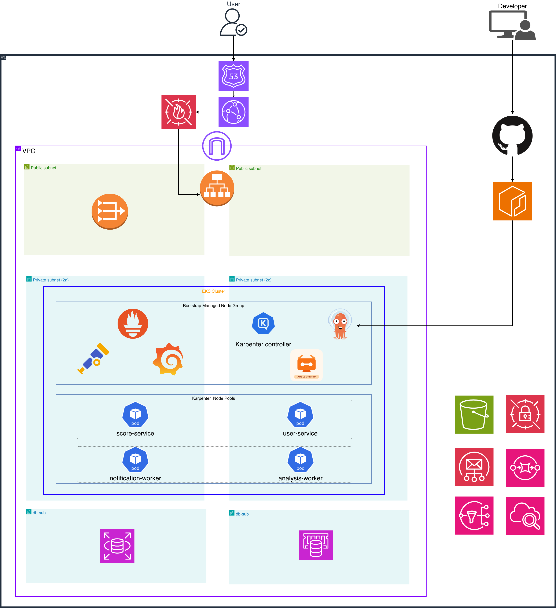
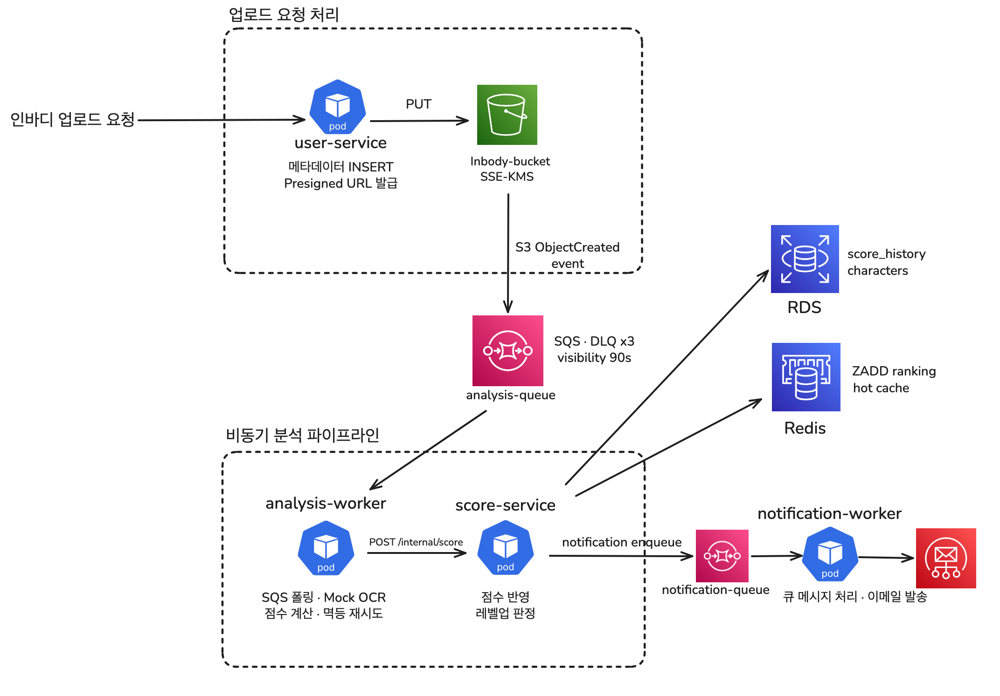
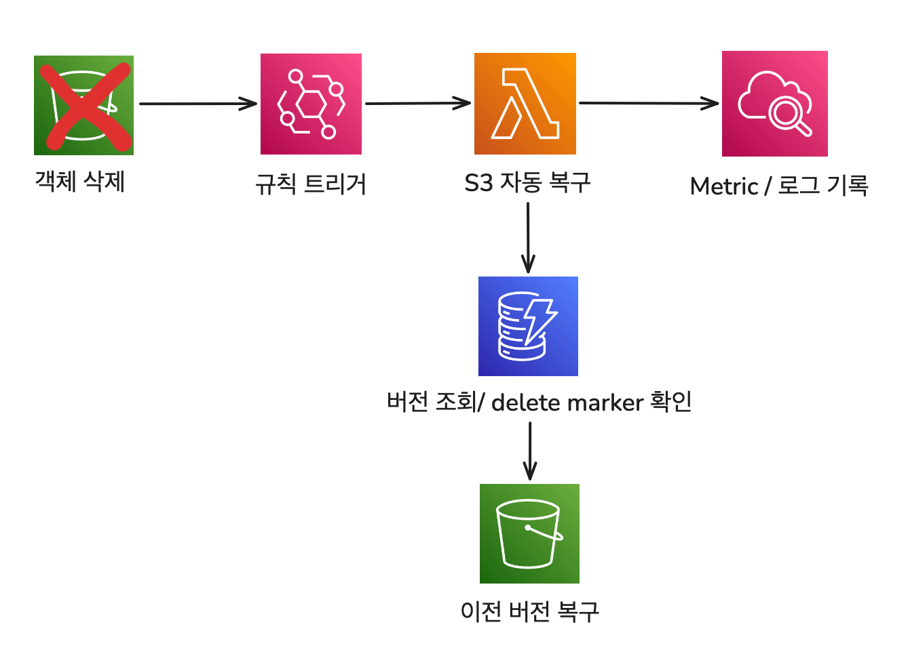

# BodyBuddy

> 인바디 결과를 점수화해 캐릭터를 키우는 헬스 서비스 — AWS EKS 위에서 비동기 MSA를 운영하며 GitOps, 관측성, Spot 비용 최적화, DR을 실제 증거로 구현한 클라우드 인프라 설계를 목표로 합니다

## 메인 아키텍처



### 인바디 업로드 비동기 처리 흐름



### 서비스 흐름

```text
Client
  |
  | POST /api/v1/uploads
  v
user-service
  |
  | SQS message
  v
analysis-worker
  |
  | POST /internal/v1/score
  v
score-service
  |
  | notification event
  v
notification-worker
```

Runtime placement:

| Workload | NodePool | Capacity | Reason |
|---|---|---|---|
| `user-service` | `critical-pool` | on-demand | user-facing API, lower latency sensitivity |
| `score-service` | `critical-pool` | on-demand | ranking/read API, HPA target |
| `analysis-worker` | `batch-pool` | spot | async processing, retryable with SQS |
| `notification-worker` | `batch-pool` | spot | async notification, delay-tolerant |

---

## What This Project Proves

| 영역 | 구현 내용 | 검증 증거 |
|---|---|---|
| MSA on EKS | Go 기반 API 2개와 worker 2개를 EKS에 배포 | ArgoCD 전체 `Synced Healthy`, 서비스별 readiness 확인 |
| GitOps | ArgoCD App-of-Apps로 Helm chart 관리 | Git 변경 후 자동 sync, self-heal 운영 |
| 비동기 처리 | `user-service -> SQS -> analysis-worker -> score-service` 흐름 | 업로드 후 score 반영, worker 로그 |
| Spot 운영 | API는 on-demand, worker는 Spot 노드로 분리 | Spot 노드 drain, re-queue, 새 worker 재처리 |
| DR | S3 자동 복구, RDS PITR, 복구 런북 | Lambda 로그, RDS restore, RTO/RPO 매트릭스 |
| 부하 테스트 | k6 기반 upload/ranking 측정과 HPA 튜닝 | `p95 417.59ms -> 35.65ms`, `1 -> 4 replicas` |

---

## DR

현재 BodyBuddy에 구현한 복구 전략은 세 가지다. Kubernetes와 ArgoCD는 Pod/Deployment 삭제 시 선언형 상태를 기준으로 서비스를 다시 복구하고, batch 워커는 SQS 메시지를 성공 시에만 삭제하도록 구성해 interruption 이후에도 다른 worker가 메시지를 재처리할 수 있다. 여기에 `upload_id` 기반 멱등성 처리를 더해 동일한 분석 결과가 다시 들어와도 중복 반영되지 않게 했다.

| 장애 유형 | 구현 방식 | 현재 보장하는 것 |
|---|---|---|
| Pod / Deployment 삭제 | ReplicaSet + ArgoCD self-heal | 서비스 프로세스 자동 재생성, desired state 복구 |
| Spot / worker 종료 | SIGTERM graceful shutdown + SQS 재노출 | 신규 polling 중단, in-flight 처리 후 종료, 다른 worker 재처리 |
| S3 객체 삭제 | Versioning + Object Lock + EventBridge + Lambda | 최신 delete marker 제거, 이전 버전 자동 복원, 메일/대시보드 기록 |

### Spot 중단 시 Worker 재처리 흐름

```text
                    Spot Node
                       │
          ┌────────────┴────────────┐
          │      analysis-worker    │
          │   · polls SQS           │
          │   · processes message   │
          └────────────┬────────────┘
                       │
              Interruption notice
              (node drain / SIGTERM)
                       │
          ┌────────────┴────────────┐
          │    Graceful shutdown    │
          │  · stop polling         │
          │  · finish in-flight     │
          │  · NO DeleteMessage     │
          └────────────┬────────────┘
                       │
            visibility timeout expires
                       │
          ┌────────────┴────────────┐
          │   Message reappears     │
          │   in analysis-queue     │
          └────────────┬────────────┘
                       │
          ┌────────────┴────────────┐
          │      New worker         │
          │ rescheduled by Karpenter│
          │   on another node       │
          └────────────┬────────────┘
                       │
          ┌────────────┴────────────┐
          │      score-service      │
          │  · idempotent update    │
          │  · upload_id dedup      │
          └─────────────────────────┘
```

Batch worker는 Spot 노드에서 실행하지만, SQS visibility timeout과 멱등성 처리로 interruption 이후에도 메시지 유실 없이 안전하게 재처리할 수 있도록 설계했다.

Core log:

```text
context cancelled during mock OCR sleep, re-queuing message
shutdown signal received, stopping polling loop
all in-flight messages processed
```

### S3 백업 / 복구



S3 객체 삭제 이벤트는 EventBridge와 Lambda로 연결하고, 최신 delete marker를 제거해 이전 버전을 다시 현재 버전으로 복원한다. 복구 결과는 SES 메일과 Grafana 대시보드로 함께 남겨 운영자가 삭제 감지 시점의 상태와 복구 성공 여부를 바로 확인할 수 있게 했다.

<div align="center">
  
  &nbsp;
  
</div>
<p align="center"><em>자동 복구 알림 메일 &nbsp;&nbsp;&nbsp; DR 대시보드</em></p>

메일에는 삭제 비율, 임계값, 삭제 마커 수, 복구 결과를 요약했고, 대시보드에는 자동 복구 호출 수, 복구된 객체 수, 실패 수, 복구 전 삭제 비율을 시각화했다.

### RDS PITR

| Scenario | Result |
|---|---|
| S3 object delete | Lambda가 delete marker를 제거해 약 `1.247s`에 자동 복구 |
| RDS data loss | PITR restore로 새 DB 인스턴스 `available` 도달 확인 |
| Recovery matrix | RTO/RPO 목표와 실측값을 표로 정리 |

---

## 관측성

kube-prometheus-stack으로 Prometheus + Grafana를 올리고, CloudWatch 데이터소스를 연결해 서비스 RED 메트릭과 DR 지표를 단일 화면에서 확인할 수 있도록 구성했다.


---

## 부하 테스트 및 오토스케일링

`score-service` ranking read 부하를 기준으로 HPA 적용 전후를 비교했다.

| Test | Before | After |
|---|---:|---:|
| Throughput | `377.35 req/s` | `572.03 req/s` |
| p95 latency | `417.59ms` | `35.65ms` |
| Error rate | `0%` | `0%` |
| Replicas | `1` | `4` |

---

## 기술 스택

| 분류 | 기술 |
|---|---|
| **언어 / 프레임워크** | Go 1.24, Gin, pgx/v5, go-redis/v9, aws-sdk-go-v2 |
| **로깅 / 메트릭 / 트레이싱** | slog (JSON), Prometheus, OpenTelemetry (OTLP), Grafana Tempo |
| **컨테이너** | Docker (멀티스테이지), distroless/static-debian12:nonroot |
| **오케스트레이션** | AWS EKS 1.33, Karpenter v1.x (critical-pool on-demand / batch-pool Spot) |
| **GitOps / CI-CD** | ArgoCD (App-of-Apps), GitHub Actions (OIDC → ECR push) |
| **IaC** | Terraform ~>1.9 (VPC, EKS, Karpenter, RDS, ElastiCache, S3, SQS, Lambda, ECR, IAM/IRSA) |
| **데이터 스토어** | RDS PostgreSQL 15 (PITR, SSE), ElastiCache Redis 7 (TLS, Sorted Set 랭킹) |
| **메시징** | SQS (analysis-queue / notification-queue + DLQ), EventBridge |
| **보안** | IRSA (서비스별 최소 권한), AWS Secrets Manager, SSE-KMS, S3 Object Lock |
| **관측성 스택** | kube-prometheus-stack, OTel Collector, Grafana Tempo, KubeCost |
| **부하 테스트** | k6 (upload-burst / ranking-read 시나리오) |
| **이메일** | AWS SES |

---

## Repository Layout

```text
bodybuddy-app/
  cmd/                 # Go service entrypoints
  internal/            # auth, db, cache, queue, domain, observability
  deploy/helm/         # service Helm charts
  test/load/           # k6 load test scripts
  migrations/          # PostgreSQL schema

bodybuddy-infra/
  terraform/           # AWS infrastructure modules and dev entrypoint
  argocd/              # App-of-Apps and application manifests
  runbooks/            # operational recovery procedures
  reports/             # drill reports, RTO/RPO, load test results
```

---

## Main Documents

- [Infrastructure README](./bodybuddy-infra/README.md)
- [Application README](./bodybuddy-app/README.md)
- [Architecture Overview](./bodybuddy-app/docs/architecture.md)
- [Architecture Decisions](./bodybuddy-app/docs/adr/README.md)
- [RTO / RPO Matrix](./bodybuddy-infra/reports/rto-rpo-matrix.md)
- [Load Test Report](./bodybuddy-infra/reports/load-test-report.md)
- [Reports Index](./bodybuddy-infra/reports/README.md)
- [RDS PITR Runbook](./bodybuddy-infra/runbooks/rds-pitr-restore.md)
- [S3 Recovery Runbook](./bodybuddy-infra/runbooks/s3-mass-delete-recovery.md)
- [GitOps Recovery Runbook](./bodybuddy-infra/runbooks/gitops-cluster-recovery.md)
- [Demo Video Script](./bodybuddy-infra/reports/demo-video-script.md)

---

## Local Load Test

Upload burst:

```bash
cd bodybuddy-app
K6_BASE_URL=http://localhost:8080 \
K6_TOKEN=<JWT_TOKEN> \
make load-upload-smoke
```

Ranking read:

```bash
cd bodybuddy-app
K6_SCORE_BASE_URL=http://localhost:8081 \
make load-ranking-smoke
```

---

## Operational Notes

- Dev infrastructure is designed to be destroyed when not in use.
- After destroy/reapply, run the recovery checklist before expecting GitOps to converge.
- Some values are regenerated by AWS, especially RDS endpoint/password, Redis endpoint, subnet IDs, and EKS OIDC provider.
- `bodybuddy-infra/scripts/refresh-dev-values.sh` exists to reduce manual drift after recreation.
