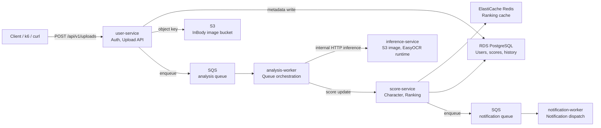
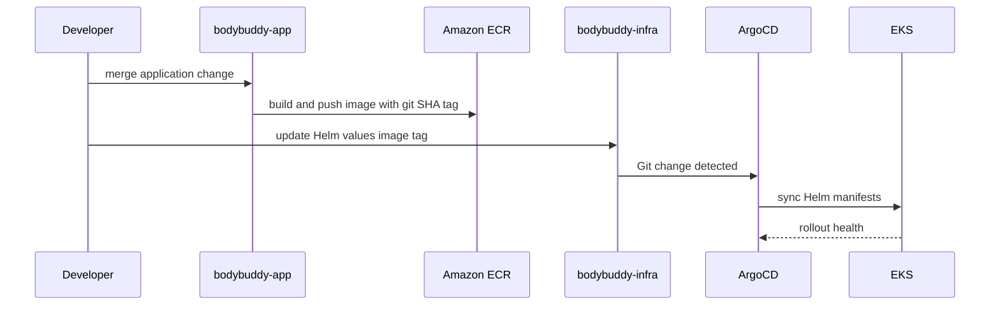
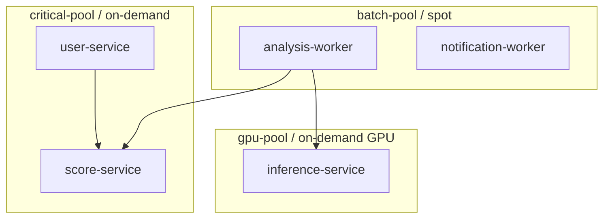

# BodyBuddy Architecture

## 목적

BodyBuddy는 인바디 결과 업로드를 점수화하고, 캐릭터 성장과 랭킹으로 연결하는 서비스다. 이 문서는 기능 설명보다 **AWS EKS 위에서 비동기 MSA를 어떻게 운영했는지**를 빠르게 이해시키는 데 초점을 둔다.

## 전체 구성

## 서비스 분리 기준

서비스는 도메인 크기보다 **트래픽 특성과 장애 허용 범위**를 기준으로 나눴다.

| Service | Type | Main responsibility | Scheduling |
|---|---|---|---|
| `user-service` | Sync API | Auth, upload request, SQS enqueue | `critical-pool`, on-demand |
| `score-service` | Sync API | Score update, ranking read, character state | `critical-pool`, on-demand |
| `analysis-worker` | Async worker | SQS polling, retry, fallback orchestration | `batch-pool`, spot |
| `inference-service` | Internal API | S3 image loading, EasyOCR field extraction | `gpu-pool`, drill-only on-demand |
| `notification-worker` | Async worker | Notification queue consumption | `batch-pool`, spot |

API는 사용자 요청 경로에 있으므로 on-demand 노드에 고정했다. Worker는 SQS 기반으로 재시도가 가능하므로 spot 노드에 배치했다.

## GitOps 배포 흐름

이미지 태그는 `latest`가 아니라 짧은 git SHA를 사용한다. 배포된 이미지와 Git 커밋을 연결할 수 있고, 롤백도 values 변경으로 추적 가능하기 때문이다.

## Workload Placement

Spot 노드를 drain했을 때 `analysis-worker`는 처리 중 메시지를 re-queue했고, 새 spot 노드에서 다시 처리했다. 추론 경로는 별도 `gpu-pool`로 분리되어 있어 batch worker와 GPU inference capacity를 독립적으로 설명할 수 있다.

GPU 비용을 상시 발생시키지 않기 위해 `inference-service` 기본 replica는 0이다. 검증 시 `values.gpu-drill.yaml`로 1개를 실행하고, 종료 후 다시 0으로 내려 Karpenter가 빈 `g4dn.xlarge` 노드를 정리하게 한다.

## Observability

| Signal | Tool | Why |
|---|---|---|
| Metrics | Prometheus, Grafana | RED metrics, HPA, infrastructure 상태 확인 |
| Logs | CloudWatch Logs | AWS-native 로그 저장, 운영 부담 감소 |
| Traces | OpenTelemetry Collector, Tempo | upload to worker to score 경로만 집중 추적 |
| GPU Metrics | NVIDIA device plugin, DCGM exporter | GPU utilization, framebuffer memory, inference workload 상태 확인 |
| Cost | KubeCost | namespace/workload 비용과 spot 절감 근거 확보 |

모든 경로를 과하게 추적하지 않고, 비동기 업로드 경로를 중심으로 계측했다.

## Recovery Design

| Failure | Recovery mechanism |
|---|---|
| Pod failure | Kubernetes Deployment self-heal |
| Deployment deletion | ArgoCD self-heal |
| Spot node interruption | Karpenter replacement, SQS retry, worker graceful shutdown |
| S3 object delete | Versioning, EventBridge, Lambda delete marker recovery |
| RDS data loss | Automated backup, point-in-time restore |

멀티 리전 대신 단일 리전 안에서 실제로 자주 마주칠 수 있는 장애를 측정 가능하게 복구하는 방향을 선택했다.

## 검증 산출물

- [Architecture Decisions](./adr/README.md)
- [Load Test Report](../../bodybuddy-infra/reports/load-test-report.md)
- [RTO / RPO Matrix](../../bodybuddy-infra/reports/rto-rpo-matrix.md)
- [Spot Interruption Drill](../../bodybuddy-infra/reports/06-spot-interruption-drill.md)
- [DR Drill](../../bodybuddy-infra/reports/07-dr-drill.md)
