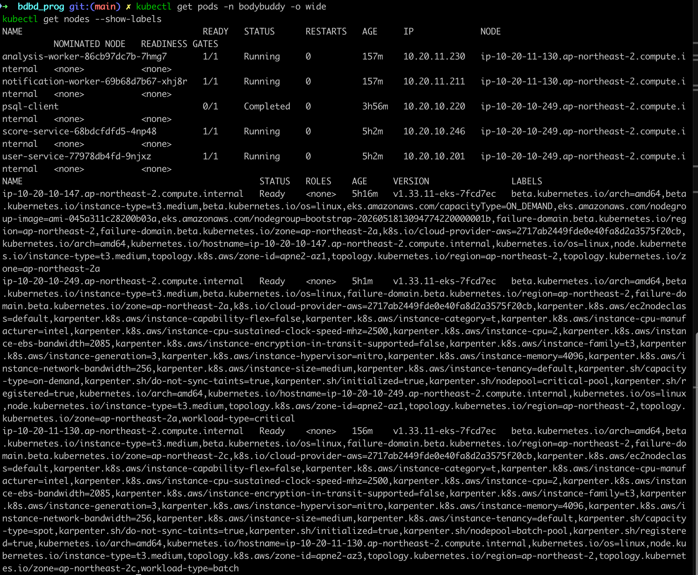
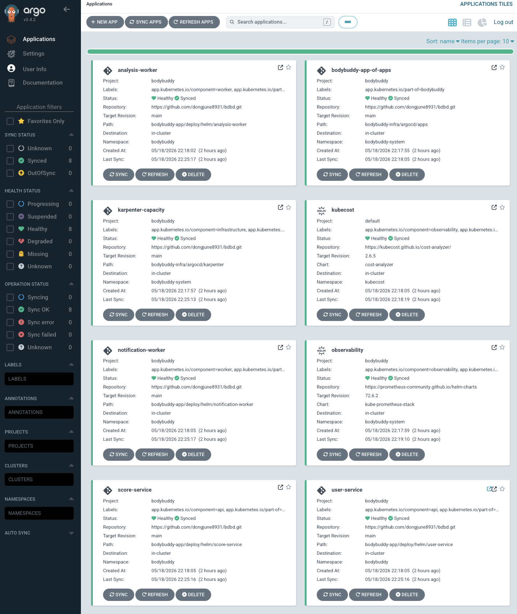
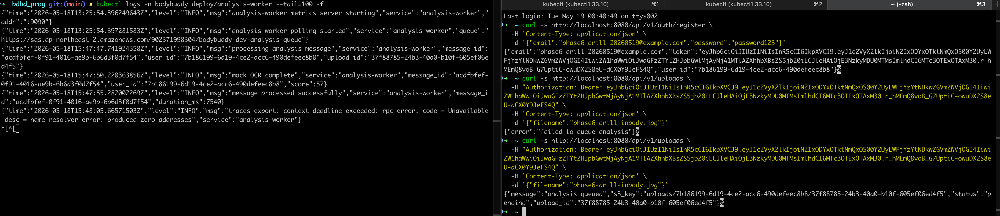
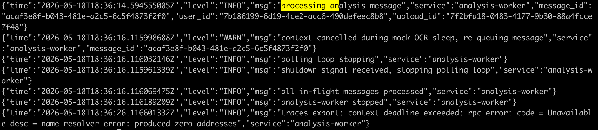
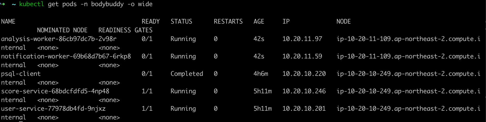
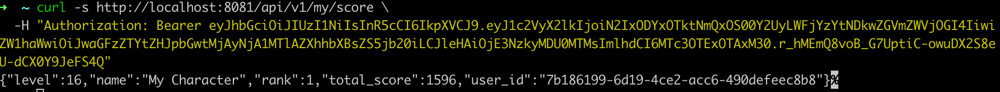

# 06. Karpenter + Spot Interruption 드릴 결과

> **환경**: EKS 1.33, Karpenter, ap-northeast-2, 단일 리전  
> **검증 목표**: API와 worker를 서로 다른 NodePool에 분리하고, batch/spot 노드 축출 시 worker graceful shutdown, 메시지 re-queue, 새 spot 노드 재스케줄, 최종 결과 무결성을 확인한다.  
> **최종 재시연 시각**: 2026-05-19 KST

---

## 1. 목적

이번 드릴에서 실제로 증명하고 싶었던 것은 네 가지였다.

1. `user-service`, `score-service`는 `critical-pool / on-demand`에만 배치된다.
2. `analysis-worker`, `notification-worker`는 `batch-pool / spot`에만 배치된다.
3. worker가 메시지를 처리하는 도중 spot 성격의 노드 축출이 발생해도, worker는 즉시 강제 종료되지 않고 안전하게 polling을 멈춘다.
4. in-flight 메시지는 유실되지 않고 re-queue된 뒤, 새 worker가 이어서 처리한다.

이번 드릴은 실제 Spot interruption notice를 기다리는 대신, **spot worker 노드에 `kubectl drain`을 수행해 termination 흐름을 강제로 재현**하는 방식으로 진행했다.

---

## 2. 사전 구성

### 2.1 NodePool 분리

- `critical-pool`
  - `karpenter.sh/capacity-type=on-demand`
  - `workload-type=critical`
- `batch-pool`
  - `karpenter.sh/capacity-type=spot`
  - `workload-type=batch`

### 2.2 워크로드 pinning

Helm values에서 다음과 같이 `nodeSelector`를 명시했다.

- `user-service`, `score-service`
  - `nodeSelector.workload-type=critical`
- `analysis-worker`, `notification-worker`
  - `nodeSelector.workload-type=batch`

### 2.3 드릴 전 배치 상태

재시연 시작 시점 기준 배치는 아래와 같았다.

| 구분 | 노드 | capacity type | nodepool | 주요 파드 |
|---|---|---|---|---|
| API | `ip-10-20-10-249.ap-northeast-2.compute.internal` | on-demand | `critical-pool` | `user-service`, `score-service` |
| Worker | `ip-10-20-11-130.ap-northeast-2.compute.internal` | spot | `batch-pool` | `analysis-worker`, `notification-worker` |

관련 캡처:

- [workload placement before drill](./evidence/07-dr-drill/00-overview/01-workload-placement-before-drill-redo.png)
- [argocd healthy before drill](./evidence/07-dr-drill/00-overview/02-argocd-healthy-before-drill.png)

드릴 전 워크로드 배치:



ArgoCD 정상 상태:



---

## 3. 드릴 시나리오

### 3.1 테스트 유저

재시연에 사용한 테스트 유저는 아래와 같다.

- `user_id`: `7b186199-6d19-4ce2-acc6-490defeec8b8`
- `email`: `<SPOT_DRILL_TEST_EMAIL>`

### 3.2 업로드 요청 생성

`user-service`의 `/api/v1/uploads`를 통해 analysis queue에 업로드 작업을 여러 건 넣었다.  
초기에는 `user-service` IRSA가 예전 OIDC를 신뢰하고 있어 `AssumeRoleWithWebIdentity` 403이 발생했고, 이를 수정한 뒤 재시도했다.

이 수정 자체가 중요한 포인트였다.

- 원인: `bodybuddy-dev-user-service-irsa` 역할만 예전 EKS OIDC provider를 신뢰
- 증상: `failed to publish to analysis queue`
- 조치: IAM trust policy를 현재 EKS OIDC로 갱신

수정 후 업로드 응답은 정상적으로 `analysis queued`가 반환됐다.

관련 캡처:

- [upload queued before drain](./evidence/07-dr-drill/00-overview/03-upload-queued-before-drain.png)



### 3.3 처리 중 drain 유도

핵심은 **worker가 실제로 메시지를 처리하는 도중** `kubectl drain`을 넣는 것이었다.

최종 성공 시나리오에서 drain 대상이 된 worker 노드는 아래와 같았다.

```bash
kubectl drain ip-10-20-11-145.ap-northeast-2.compute.internal \
  --ignore-daemonsets \
  --delete-emptydir-data
```

drain 출력:

```text
node/ip-10-20-11-145.ap-northeast-2.compute.internal cordoned
evicting pod bodybuddy/notification-worker-69b68d7b67-fq5nx
evicting pod bodybuddy/analysis-worker-86cb97dc7b-8br7s
pod/notification-worker-69b68d7b67-fq5nx evicted
pod/analysis-worker-86cb97dc7b-8br7s evicted
node/ip-10-20-11-145.ap-northeast-2.compute.internal drained
```

---

## 4. 관찰 결과

### 4.1 analysis-worker graceful shutdown + re-queue 확인

이번 재시연에서 가장 중요한 로그는 아래 구간이었다.

```text
processing analysis message ... upload_id=7f2bfa18-0483-4177-9b30-88a4fcce7f48
context cancelled during mock OCR sleep, re-queuing message
polling loop stopping
shutdown signal received, stopping polling loop
all in-flight messages processed
analysis-worker stopped
```

이 로그가 의미하는 것은 다음과 같다.

1. worker가 실제로 메시지를 처리 중이었다.
2. drain/SIGTERM이 들어오자 sleep 중인 작업 컨텍스트가 취소됐다.
3. worker는 메시지를 조용히 잃어버리지 않고 **re-queue**했다.
4. 신규 polling을 멈추고 종료 시퀀스를 밟았다.

즉 이번 드릴로 **"처리 중 interruption -> 안전한 중단 -> 메시지 재전달"** 경로를 직접 확인했다.

관련 캡처:

- [analysis-worker graceful shutdown and re-queue](./evidence/07-dr-drill/00-overview/04-analysis-worker-graceful-shutdown-and-requeue.png)



### 4.2 새 spot 노드 자동 생성과 worker 재스케줄

drain 이후 Karpenter는 새로운 batch/spot 노드를 붙였고, worker 두 개를 그 노드로 재배치했다.

재배치 후 상태:

| 파드 | 새 노드 |
|---|---|
| `analysis-worker-86cb97dc7b-2v98r` | `ip-10-20-11-109.ap-northeast-2.compute.internal` |
| `notification-worker-69b68d7b67-6rkp8` | `ip-10-20-11-109.ap-northeast-2.compute.internal` |

반면 API는 여전히 기존 critical/on-demand 노드에 남아 있었다.

| 파드 | 노드 |
|---|---|
| `user-service-77978db4fd-9njxz` | `ip-10-20-10-249.ap-northeast-2.compute.internal` |
| `score-service-68bdcfdfd5-4np48` | `ip-10-20-10-249.ap-northeast-2.compute.internal` |

이로써 drain 이후에도 **API는 critical**, **worker는 batch**라는 배치 원칙이 유지됨을 확인했다.

관련 캡처:

- [workers rescheduled after drain](./evidence/07-dr-drill/00-overview/05-workers-rescheduled-after-drain-redo.png)



### 4.3 re-queued 메시지의 실제 재처리 확인

새 `analysis-worker` 로그에서는 재시작 직후 여러 메시지를 다시 처리했고, 가장 중요한 것은 직전에 re-queue됐던 `upload_id=7f2bfa18-0483-4177-9b30-88a4fcce7f48`가 실제로 다시 소비되어 성공 처리됐다는 점이다.

핵심 구간:

```text
processing analysis message ... upload_id=7f2bfa18-0483-4177-9b30-88a4fcce7f48
mock OCR complete ... score=57
message processed successfully ... duration_ms=3724
```

즉 drain 시점에 중단된 작업이 새 worker에서 **유실 없이 이어졌다**.

### 4.4 최종 점수로 무결성 확인

드릴 후 `score-service`에서 조회한 최종 상태는 아래와 같았다.

```json
{
  "level": 16,
  "name": "My Character",
  "rank": 1,
  "total_score": 1596,
  "user_id": "7b186199-6d19-4ce2-acc6-490defeec8b8"
}
```

이번 드릴의 핵심은 점수 절대값보다도, **drain 중단 이후에도 처리 파이프라인이 최종적으로 계속 전진했다**는 것이다.

관련 캡처:

- [score after recovery](./evidence/07-dr-drill/00-overview/06-score-after-recovery-redo.png)



---

## 5. 판정

### 5.1 이번 드릴에서 증명된 것

1. **Workload 분리 성공**
   - API는 `critical-pool / on-demand`
   - worker는 `batch-pool / spot`

2. **graceful shutdown 동작**
   - worker는 SIGTERM 직후 즉시 죽지 않고 polling 중단 및 종료 시퀀스를 수행했다.

3. **처리 중 메시지 re-queue**
   - `context cancelled during mock OCR sleep, re-queuing message` 로그로 증명했다.

4. **Karpenter 자동 복구**
   - drain 후 새로운 batch/spot 노드가 생성됐고 worker가 그 노드로 재배치됐다.

5. **메시지 유실 없이 처리 지속**
   - re-queue된 메시지가 새 worker에서 다시 처리됐고, 최종 score 반영까지 이어졌다.

### 5.2 이번 드릴에서 얻은 실무 포인트

- Spot interruption 대응을 보려면 단순히 drain만 하는 것으로는 부족하고, **실제 처리 중인 시점에 drain을 걸어야** 한다.
- dev 환경을 destroy/reapply한 뒤에는 IRSA trust policy가 새 OIDC를 가리키는지 꼭 다시 확인해야 한다.
- `analysis-worker`처럼 처리 시간이 있는 비동기 워커는, shutdown 시 **"신규 수신 중단 + 현재 메시지 취소 + 재전달"** 패턴이 있어야 유실을 막을 수 있다.

---

## 6. 결론

이번 재시연으로 06번 작업의 핵심 acceptance criteria 중 아래 항목을 직접 증명했다.

- worker Pod이 batch/spot 노드에서만 실행됨
- spot 성격의 노드 축출 시 graceful shutdown 로그가 남음
- 처리 중 메시지가 re-queue됨
- 새 worker가 새 spot 노드에서 다시 올라와 메시지를 이어 처리함
- 최종 score 반영으로 메시지 유실 없이 복구됐음을 확인함

즉 이번 드릴은 단순히 "노드가 다시 떠요" 수준이 아니라, **비동기 워크로드가 interruption을 겪어도 안전하게 복구되는지**를 실제 로그와 결과값으로 남긴 사례라고 볼 수 있다.
