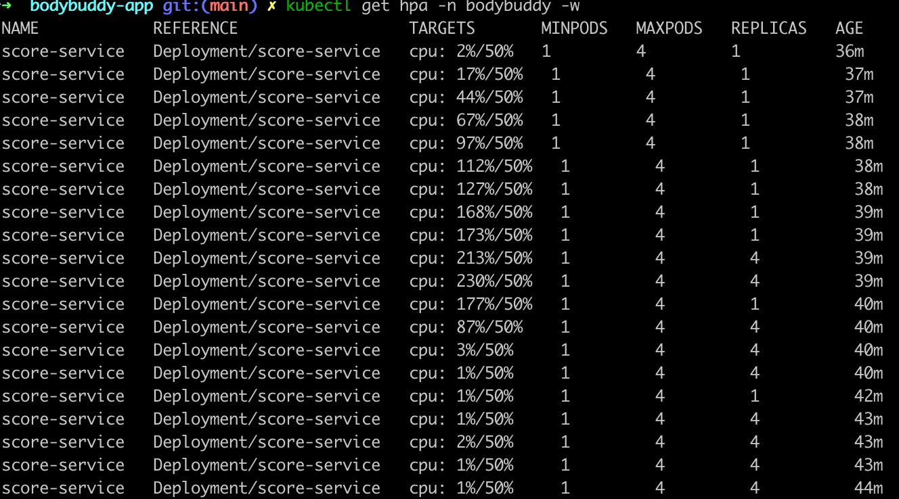
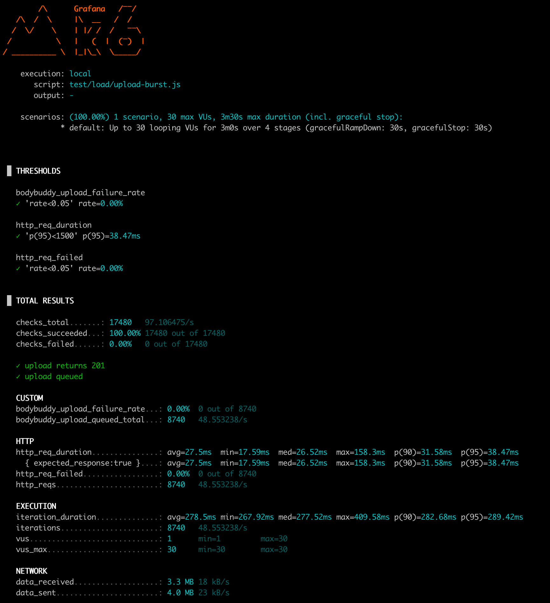

# Load Test Report

## 목적

이 문서는 BodyBuddy dev 환경에서 수행한 부하 테스트 결과를 기록하는 템플릿이다.

챕터 8의 목표는 단순히 "버틴다"를 보여주는 것이 아니라, 아래를 숫자로 남기는 것이다.

1. 업로드 부하 시 `user-service -> SQS -> analysis-worker` 경로가 어디서 병목이 생기는지
2. 랭킹 조회 부하 시 `score-service`가 Redis 캐시를 얼마나 잘 활용하는지
3. HPA와 Karpenter가 실제로 Pod와 노드를 확장하는지
4. 1차 측정 후 어떤 튜닝을 했고, 2차에서 얼마나 나아졌는지

---

## 시나리오

### 1. Upload Burst

- 스크립트: `bodybuddy-app/test/load/upload-burst.js`
- 대상: `POST /api/v1/uploads`
- 목적:
  - `user-service` 응답 지연/오류율 측정
  - analysis queue 적재량 증가 확인
  - `analysis-worker` 처리 backlog 및 batch node 확장 관찰

### 2. Ranking Read

- 스크립트: `bodybuddy-app/test/load/ranking-read.js`
- 대상: `GET /api/v1/ranking`
- 목적:
  - `score-service` read-heavy 경로 응답시간 측정
  - Redis 캐시 기반 랭킹 조회 성능 확인
  - HPA/CPU 반응 관찰

---

## 실행 커맨드

### Upload Burst

```bash
cd /Users/idongjun/Desktop/Project/bdbd_prog/bodybuddy-app
K6_BASE_URL=http://localhost:8080 \
K6_TOKEN=<JWT_TOKEN> \
make load-upload-smoke
```

### Ranking Read

```bash
cd /Users/idongjun/Desktop/Project/bdbd_prog/bodybuddy-app
K6_SCORE_BASE_URL=http://localhost:8081 \
make load-ranking-smoke
```

---

## 측정 포인트

### 애플리케이션

- `user-service`
  - request rate
  - error rate
  - p50 / p95 / p99
- `score-service`
  - request rate
  - error rate
  - p50 / p95 / p99
- `analysis-worker`
  - queue backlog
  - 처리량
  - 처리 지연

### 인프라

- HPA scale out 여부
- Karpenter node scale out 여부
- batch node / critical node 분리 유지 여부
- CPU / memory saturation

---

## 결과 표

### 1차 측정

| 시나리오 | RPS/VUs | p50 | p95 | p99 | Error Rate | 비고 |
|---|---:|---:|---:|---:|---:|---|
| Upload Burst | 약 48.55 req/s, max 30 VUs | 26.52ms | 38.47ms | 미기록 | 0% | `/api/v1/uploads`, 단일 replica에서도 안정적 |
| Ranking Read | 약 377.35 req/s, max 150 VUs | 21.24ms | 417.59ms | 미기록 | 0% | HPA 비활성 상태, tail latency가 상대적으로 큼 |

### 튜닝 내용

1. `metrics-server`를 ArgoCD로 추가해 Metrics API를 활성화했다.
2. `score-service` Helm values에서 CPU 기반 HPA를 활성화했다.
3. `score-service` HPA 설정:
   - `minReplicas: 1`
   - `maxReplicas: 4`
   - `targetCPUUtilizationPercentage: 50`

적용 배경:

- 1차 `ranking-read` 측정에서는 실패율은 0%였지만 `p95`가 `417.59ms`까지 상승했다.
- 같은 시점에 `bodybuddy` 네임스페이스에는 HPA가 없었고, `Metrics API not available` 상태였다.
- 즉 애플리케이션 자체는 동작했지만, **오토스케일링 기반의 성능 개선 실험이 불가능한 상태**였기 때문에 먼저 scale-out 기반을 추가했다.

### 2차 측정

| 시나리오 | RPS/VUs | p50 | p95 | p99 | Error Rate | 비고 |
|---|---:|---:|---:|---:|---:|---|
| Upload Burst | 재측정 전 | - | - | - | - | 업로드 경로는 1차에서도 충분히 안정적이어서 우선순위 낮음 |
| Ranking Read | 약 572.03 req/s, max 150 VUs | 15.75ms | 35.65ms | 미기록 | 0% | HPA가 `1 -> 4 replicas` scale-out |

---

## 관찰 캡처

권장 캡처:

- `evidence/phase-7-dr/phase-8-load/01-score-service-hpa-scale-out.png`
- `evidence/phase-7-dr/phase-8-load/02-ranking-read-second-run-result.png`
- 필요 시 Grafana CPU/HPA 그래프 추가

이번 실측에서 바로 확인한 장면:

- `score-service` HPA가 `cpu: 213%/50%`까지 상승하며 `REPLICAS 1 -> 4`로 scale-out
- 부하 종료 후에도 새 replica 3개가 `1/1 Running` 상태로 유지
- 2차 `ranking-read` 결과에서 `p95 35.65ms`, `572 req/s`, `0% errors` 확인

HPA scale-out 장면:



2차 ranking-read 결과:



---

## 해석

## 1차 해석

- `upload-burst`는 단일 replica `user-service`로도 충분히 처리됐다.
- `ranking-read`는 실패율 없이 버텼지만, `p95`가 `417.59ms`로 튀어 tail latency가 눈에 띄었다.
- 당시에는 HPA가 없고 Metrics API도 비활성 상태였으므로, 성능 병목을 "코드 최적화"보다 먼저 "자동 확장 부재"로 해석하는 것이 더 맞았다.

## 2차 해석

- `metrics-server`와 `score-service` HPA를 켠 뒤 같은 `ranking-read` 부하를 다시 걸자, `p95`가 `417.59ms -> 35.65ms`로 크게 내려갔다.
- 처리율도 `377 req/s -> 572 req/s`로 증가했다.
- 즉 이번 챕터의 첫 번째 개선 스토리는 "캐시 로직 수정"보다 **CPU 기반 scale-out 활성화만으로 tail latency를 크게 줄였다**는 것이다.

## 남은 보강 포인트

1. Grafana CPU/HPA 그래프 캡처 추가
2. `upload-burst`도 HPA/KEDA 대상에 포함할지 결정
3. analysis queue depth 기반 확장까지 붙이면 worker scale-out 스토리를 더 만들 수 있음
