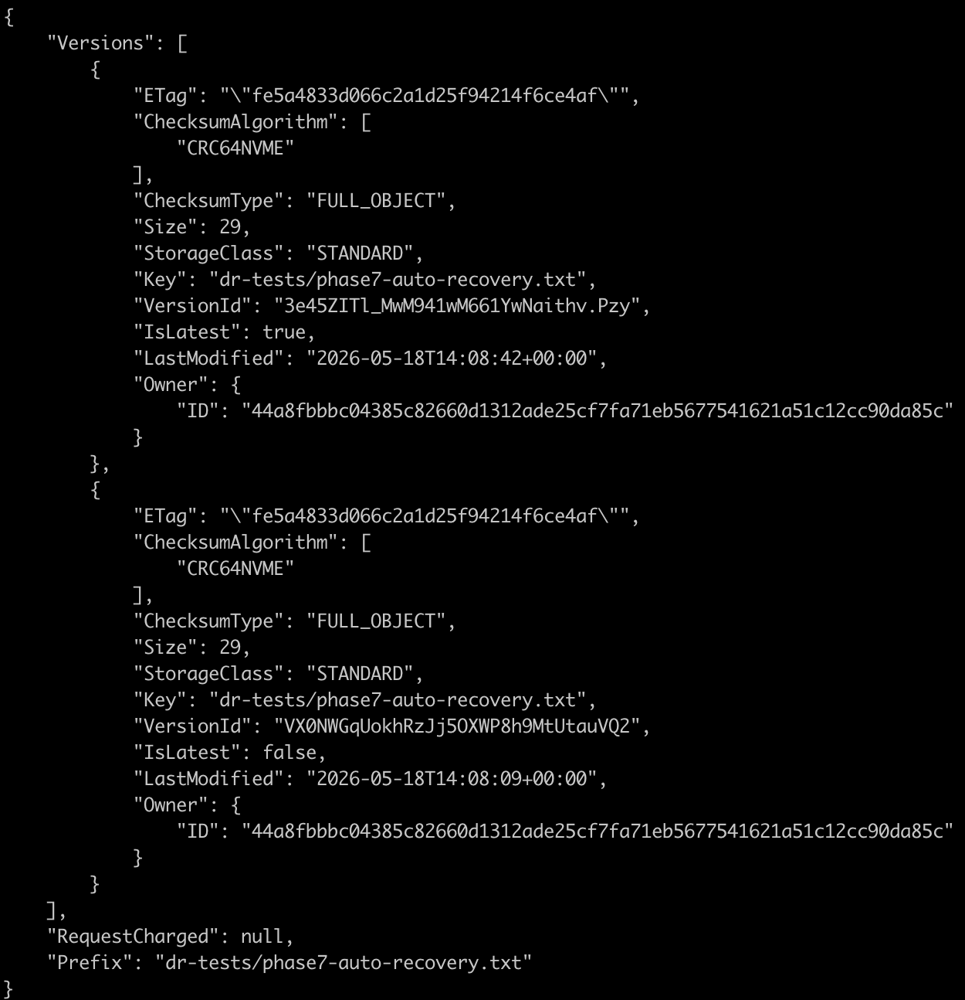
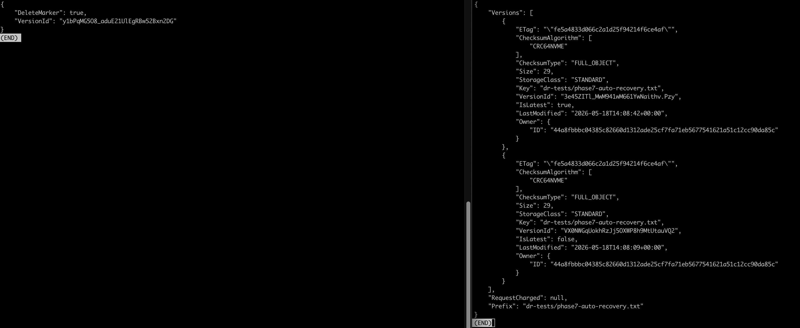
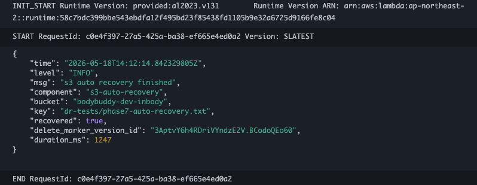
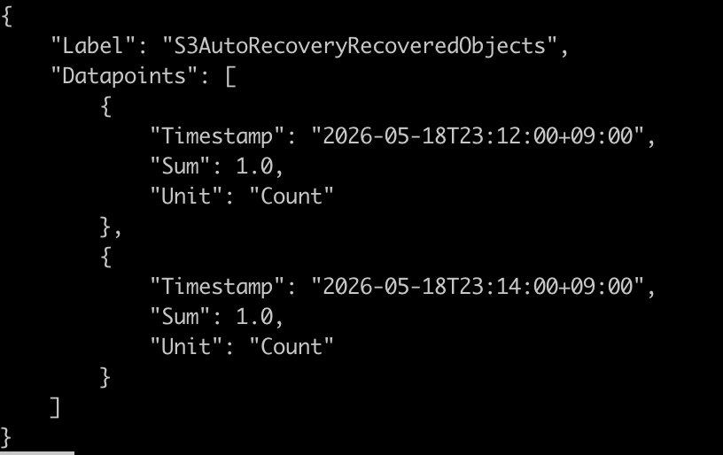
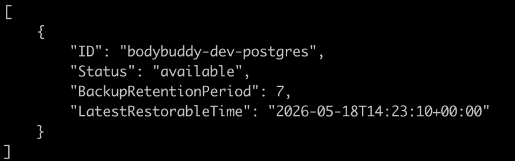
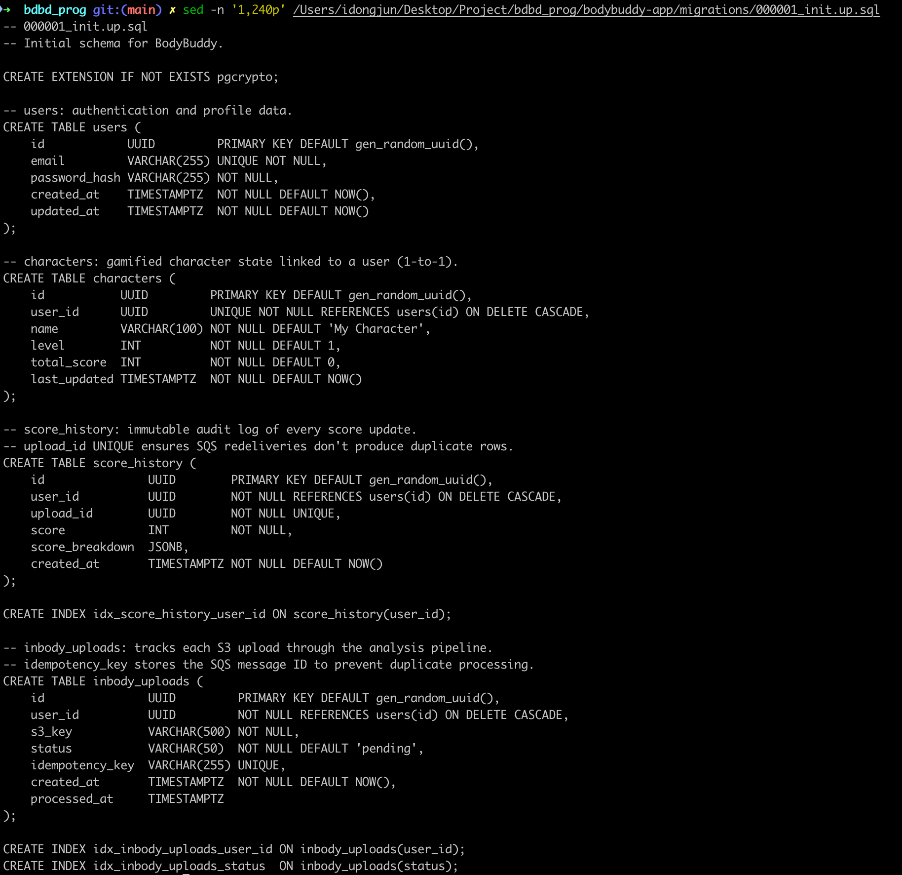
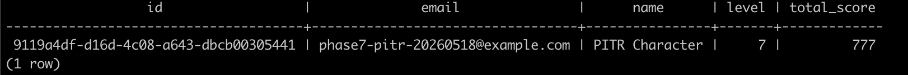
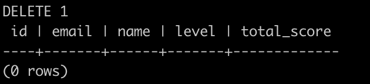
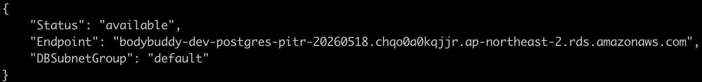

# Phase 7: DR Drill - S3 Auto Recovery and RDS PITR

## Overview

Phase 7의 목표는 "복구가 된다"를 말로 끝내지 않고, 실제 장애 시나리오를 실행해 RTO/RPO를 측정 가능한 형태로 남기는 것이다.

이번 드릴에서는 두 축을 검증했다.

1. `S3` 객체 삭제 시 자동 복구
2. `RDS PostgreSQL` 데이터 손실 후 PITR 복원

관련 캡처와 원본 증거는 [phase-7-dr evidence](./evidence/phase-7-dr/README.md) 구조 아래에 정리한다.

---

## 1. S3 Auto Recovery

### 1.1 목적

Versioning과 EventBridge, Lambda를 조합해 S3 객체 삭제 시 delete marker를 자동 제거하고 원본 객체를 복구하는 흐름을 검증했다.

### 1.2 사전 확인

- Lambda: `bodybuddy-dev-s3-auto-recovery`
- EventBridge rule: `bodybuddy-dev-s3-auto-recovery-s3-object-deleted`
- Bucket: `bodybuddy-dev-inbody`

검증 결과:

- Lambda 상태: `Active`
- EventBridge rule 상태: `ENABLED`

### 1.3 시나리오

1. 테스트 파일 `dr-tests/phase7-auto-recovery.txt` 업로드
2. `list-object-versions`로 삭제 전 최신 버전 확인
3. `delete-object` 실행
4. Lambda 로그와 S3 version 상태를 확인해 자동 복구 여부 검증
5. CloudWatch custom metric 기록 여부 확인

### 1.4 결과

- 삭제 응답에서 `DeleteMarker: true` 확인
- 직후 `list-object-versions` 결과에서 최신 버전이 다시 일반 객체로 복귀
- Lambda 로그에서 아래 성공 이벤트 확인

```json
{
  "msg": "s3 auto recovery finished",
  "bucket": "bodybuddy-dev-inbody",
  "key": "dr-tests/phase7-auto-recovery.txt",
  "recovered": true,
  "delete_marker_version_id": "3AptvY6h4RDriVYndzE2V.BCodoQEo60",
  "duration_ms": 1247
}
```

- CloudWatch metric `BodyBuddy/DR > S3AutoRecoveryRecoveredObjects` datapoint 확인

### 1.5 해석

- 복구 성공 여부는 `recovered: true` 로그로 판정
- 후속 이벤트에서 `recovered: false`가 한 번 더 찍힌 것은 이미 복구가 끝난 뒤 동일 키에 대해 추가 처리할 것이 없었던 경우로 해석
- 즉, "삭제 이벤트 감지 -> delete marker 제거 -> 객체 최신 버전 복귀"가 실제로 동작했다

### 1.6 증거

- [evidence/phase-7-dr/01-s3-auto-recovery/01-before-delete-object-version.png](./evidence/phase-7-dr/01-s3-auto-recovery/01-before-delete-object-version.png)
- [evidence/phase-7-dr/01-s3-auto-recovery/02-after-auto-recovery-version.png](./evidence/phase-7-dr/01-s3-auto-recovery/02-after-auto-recovery-version.png)
- [evidence/phase-7-dr/01-s3-auto-recovery/03-lambda-recovery-log-console.png](./evidence/phase-7-dr/01-s3-auto-recovery/03-lambda-recovery-log-console.png)
- [evidence/phase-7-dr/01-s3-auto-recovery/04-cloudwatch-recovered-metric.png](./evidence/phase-7-dr/01-s3-auto-recovery/04-cloudwatch-recovered-metric.png)

삭제 전 버전 상태:



자동 복구 후 최신 객체 버전 복귀:



Lambda 복구 성공 로그:



CloudWatch 복구 메트릭:



---

## 2. RDS PITR

### 2.1 목적

RDS PostgreSQL에서 테스트 레코드를 의도적으로 삭제한 뒤, PITR로 복원 인스턴스를 생성해 데이터 손실 복구 가능성과 실제 복구 시간을 검증했다.

### 2.2 사전 확인

- Source DB instance: `bodybuddy-dev-postgres`
- Backup retention: `7 days`
- `LatestRestorableTime` 존재 확인

### 2.3 시나리오

1. RDS Secrets Manager에서 현재 접속 정보 확인
2. 임시 `psql-client` Pod로 RDS 접속
3. 앱 스키마가 비어 있음을 확인
4. `000001_init.up.sql` 마이그레이션을 직접 적용
5. 테스트 유저와 캐릭터 레코드 생성

테스트 기준 레코드:

- email: `phase7-pitr-20260518@example.com`
- name: `PITR Character`
- level: `7`
- total_score: `777`

6. 해당 유저 레코드를 삭제해 손실 시뮬레이션
7. `restore-db-instance-to-point-in-time`로 복원 인스턴스 생성
8. 복원 인스턴스가 `available` 상태로 도달하는지 확인

### 2.4 결과

- 스키마 적용 전에는 사용자 테이블이 존재하지 않았음
- 마이그레이션 적용 후 `users`, `characters`, `score_history`, `inbody_uploads` 생성 확인
- 테스트 레코드 생성 후 삭제 성공
- PITR 요청 후 복원 인스턴스 `bodybuddy-dev-postgres-pitr-20260518` 생성 성공
- 최종 상태 `available`

복원 인스턴스 핵심 상태:

- status: `available`
- endpoint: `bodybuddy-dev-postgres-pitr-20260518.chqo0a0kqjjr.ap-northeast-2.rds.amazonaws.com`
- subnet group: `default`

### 2.5 해석

이번 드릴은 "PITR 요청이 실제로 복원 인스턴스를 생성해 `available`까지 도달하는지"를 검증하는 데는 성공했다.

다만 운영 검증 관점에서는 중요한 개선 포인트가 드러났다.

1. `LatestRestorableTime`가 삭제 직후 원하는 시점까지 바로 따라오지 않았다
2. 복원 인스턴스가 `DBSubnetGroup: default`로 생성되어 현재 EKS private subnet 경로에서 바로 애플리케이션 수준 검증을 붙이기 어려웠다

즉, 이번 드릴은 다음 두 가지를 동시에 남겼다.

- PITR 자체는 성공한다
- 실제 운영 복원 검증까지 가려면 restore 시 subnet group과 네트워크 placement를 명시해야 한다

### 2.6 트러블슈팅 포인트

#### 2.6.1 `LatestRestorableTime` 지연

삭제 후 즉시 특정 시점으로 복원하려 했지만, AWS가 허용하는 최신 복원 가능 시점이 몇 분 뒤처져 있었다.

예시 에러:

```text
The specified instance cannot be restored to a time later than 2026-05-18T14:33:10Z.
```

이것은 오류라기보다 PITR 로그 적용 지연이다. 실무적으로는 "삭제 직후 바로 restore"보다 "latest restorable time를 먼저 확인하고 시점을 정하는 절차"가 필요하다.

#### 2.6.2 복원 인스턴스의 subnet group drift

복원 인스턴스가 `default` subnet group으로 올라왔다. 이번 dev 환경에서는 이 경로가 현재 EKS private subnet과 분리될 수 있어, 복원 후 즉시 `psql-client` Pod에서 접속 검증하는 흐름이 매끄럽지 않았다.

향후에는 다음 둘 중 하나로 개선할 수 있다.

1. 복원 시점에 target subnet group을 명시하는 runbook 정비
2. 복원 검증용 bastion 혹은 별도 네트워크 경로 준비

### 2.7 증거

- [evidence/phase-7-dr/03-rds-pitr/01-rds-backup-precheck.png](./evidence/phase-7-dr/03-rds-pitr/01-rds-backup-precheck.png)
- [evidence/phase-7-dr/03-rds-pitr/02-empty-db-before-migration.png](./evidence/phase-7-dr/03-rds-pitr/02-empty-db-before-migration.png)
- [evidence/phase-7-dr/03-rds-pitr/03-baseline-record-before-loss.png](./evidence/phase-7-dr/03-rds-pitr/03-baseline-record-before-loss.png)
- [evidence/phase-7-dr/03-rds-pitr/04-record-missing-after-delete.png](./evidence/phase-7-dr/03-rds-pitr/04-record-missing-after-delete.png)
- [evidence/phase-7-dr/03-rds-pitr/05-pitr-instance-available.png](./evidence/phase-7-dr/03-rds-pitr/05-pitr-instance-available.png)

백업 보존 및 복원 가능 시점 사전 확인:



마이그레이션 전 빈 데이터베이스 상태:



복구 기준 레코드 생성:



삭제 후 데이터 손실 상태:



PITR 복원 인스턴스 available 상태:



---

## 3. RTO / RPO Draft

이번 드릴 기준으로 문서화할 때 사용할 초안은 아래와 같다.

| 장애 유형 | RTO 목표 | 실측/관찰 | RPO 목표 | 실측/관찰 | 자동화 |
|---|---:|---|---:|---|---|
| S3 객체 삭제 | 2분 | Lambda 로그 기준 약 `1247ms` 자동 복구 확인 | 0 | Versioning 기반으로 객체 본문 손실 없음 | 자동 |
| RDS 데이터 손실 | 15분 | 복원 인스턴스 생성 후 `available` 도달 확인, 세부 분 단위는 시연 타임스탬프 기반 후속 보정 필요 | 5분 | `LatestRestorableTime`가 수 분 지연될 수 있음을 확인 | 반자동 |

추가 정리는 [rto-rpo-matrix.md](./rto-rpo-matrix.md)와 [runbooks/rds-pitr-restore.md](../runbooks/rds-pitr-restore.md)에 분리했다.

---

## 4. What We Learned

- DR 시연은 콘솔보다 CLI 검증이 재현성과 근거 측면에서 훨씬 좋다
- S3 자동 복구는 비교적 짧은 RTO로 증명 가능하며, 로그와 metric을 같이 남겨야 발표 설득력이 올라간다
- RDS PITR은 "복원 가능"과 "운영 검증 가능"이 다르다
- restore 시점의 `LatestRestorableTime` 지연과 subnet group/network placement는 꼭 runbook에 반영해야 한다

---

## 5. Next Step

다음 보완 작업 우선순위는 아래 순서를 권장한다.

1. `runbooks/rds-pitr-restore.md`에 subnet group 명시 절차 추가
2. `reports/rto-rpo-matrix.md` 생성 후 이번 시연 값 반영
3. 필요하면 복원 인스턴스를 동일 VPC/private subnet 쪽으로 재검증하는 2차 드릴 수행
4. GitOps / Kubernetes self-heal DR 시연까지 같은 포맷으로 이어서 정리
