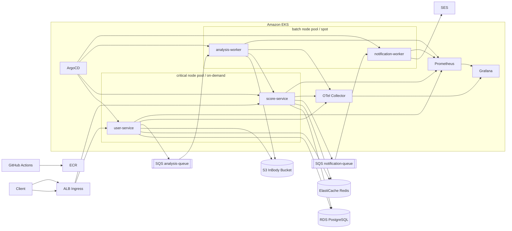
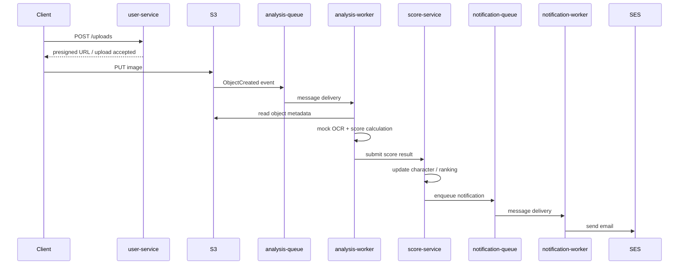
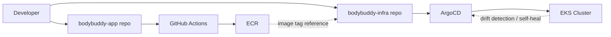
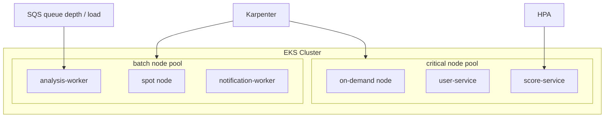
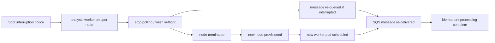
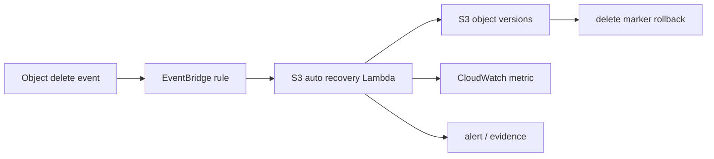
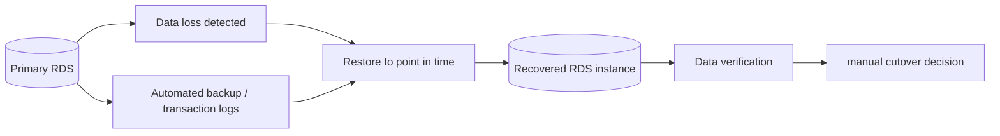
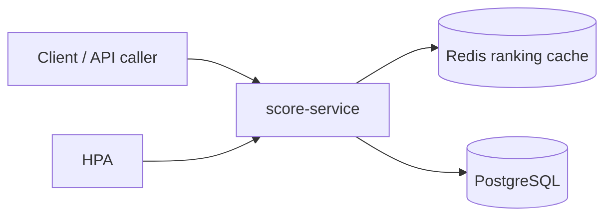
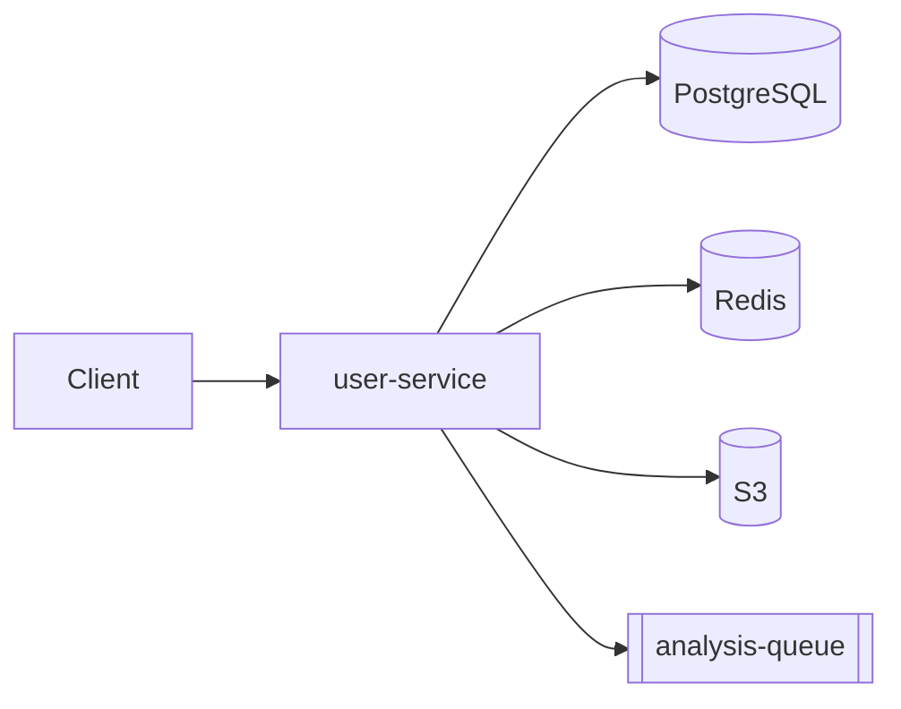

# BodyBuddy Presentation Diagram Blueprints

이 문서는 발표 자료에 바로 옮겨 담을 수 있는 다이어그램 초안 모음이다. 목적은 "어떤 내용을 말할까"보다 먼저 "어떤 구조를 그림으로 보여줄까"를 확정하는 것이다.

권장 방식은 다음과 같다.

- 먼저 이 문서의 다이어그램 구조를 기준으로 Canva에서 도형으로 다시 그린다.
- 장표에는 모든 요소를 넣지 말고, 장표 목적에 맞는 것만 남긴다.
- 텍스트보다 박스, 화살표, 색상 구분으로 계층을 보여준다.

## 1. 전체 아키텍처

이 다이어그램은 발표 초반에 한 번만 크게 보여주는 메인 장표용이다.

### Canva에서 그릴 때 포인트

- `EKS`를 큰 박스로 감싸고, 그 안을 `critical`과 `batch` 두 영역으로 나눈다.
- `user-service`, `score-service`는 같은 계층에 두고, `analysis-worker`, `notification-worker`는 별도 영역으로 내린다.
- 운영 계층인 `ArgoCD`, `Prometheus`, `Grafana`, `OTel Collector`는 하단 또는 우측에 따로 묶는다.

### 이 장표에서 강조할 메시지

- API와 worker를 SLA 기준으로 분리 운영
- 비동기 파이프라인과 상태 저장소 분리
- 배포, 관측성, 비용 전략까지 포함한 운영 구조

## 2. 업로드 비동기 처리 흐름

이 다이어그램은 서비스 동작을 설명하는 장표에 적합하다.

### Canva에서 그릴 때 포인트

- 너무 기술적인 라벨은 줄이고 `업로드`, `분석`, `점수 반영`, `알림` 4단계로 묶어도 좋다.
- `sync`와 `async`를 색으로 나누면 이해가 빨라진다.

### 이 장표에서 강조할 메시지

- 사용자 응답과 무거운 처리를 분리
- 큐 기반으로 재시도와 장애 격리 확보
- 점수 반영 이후 알림까지 비동기 체인으로 연결

## 3. GitOps 배포 흐름

이 다이어그램은 "어떻게 배포했는가"를 설명하는 장표용이다.

### Canva에서 그릴 때 포인트

- 좌측은 개발자와 GitHub, 중앙은 배포 자산, 우측은 클러스터로 정리한다.
- `App repo`와 `Infra repo`를 분리해서 보여주는 것이 핵심이다.

### 이 장표에서 강조할 메시지

- 빌드와 배포 선언을 분리
- 배포는 ArgoCD가 선언 상태 기준으로 수행
- self-heal을 통해 수동 복구 대신 선언 복원 수행

## 4. 노드풀 전략과 워크로드 배치

이 다이어그램은 Karpenter와 비용 전략을 설명하는 장표에 적합하다.

### Canva에서 그릴 때 포인트

- `critical = 안정성`, `batch = 비용 최적화`가 한눈에 보이게 색을 완전히 다르게 둔다.
- 서비스 이름보다 `API`, `Worker` 같은 역할 라벨을 같이 넣으면 좋다.

### 이 장표에서 강조할 메시지

- 모든 워크로드를 같은 노드에 올리지 않았다.
- 사용자-facing API와 지연 허용 worker를 다른 비용 정책으로 운영했다.

## 5. Spot interruption 복구 흐름

이 다이어그램은 worker 안정성 검증 장표용이다.

### Canva에서 그릴 때 포인트

- 왼쪽에서 오른쪽으로 `축출 -> 정리 -> 재스케줄 -> 재처리` 흐름만 단순하게 보여준다.
- 로그 캡처는 이 장표 하단에 작게 붙인다.

### 이 장표에서 강조할 메시지

- spot을 썼지만 데이터 유실 없이 복구되는 흐름을 설계했다.
- 핵심은 `graceful shutdown`, `SQS retry`, `idempotency` 세 가지다.

## 6. S3 자동 복구 흐름

이 다이어그램은 DR 장표 중 하나로 쓰기 좋다.

### Canva에서 그릴 때 포인트

- S3 버킷을 중심에 두기보다 `삭제 감지 -> 복원 실행` 흐름을 강조한다.
- Object Lock / Versioning은 작은 배지나 보조 박스로 붙이는 정도가 좋다.

### 이 장표에서 강조할 메시지

- 단순 백업이 아니라 삭제 이벤트를 자동 감지해 복원했다.
- 버전 관리와 거버넌스 락을 같이 사용해 복구 가능성을 높였다.

## 7. RDS PITR 복구 흐름

이 다이어그램은 반자동 DR 장표로 적합하다.

### Canva에서 그릴 때 포인트

- 프로덕션 DB와 복구 DB를 좌우로 나눠 보여준다.
- `완전 자동`이 아니라 `반자동 복구`라는 점을 명확히 표시한다.

### 이 장표에서 강조할 메시지

- 단일 리전 환경에서도 특정 시점 복원 전략을 검증했다.
- RTO와 RPO를 문서가 아니라 실제 복원 실험으로 측정했다.

## 8. score-service 설계 포인트

이 다이어그램은 특정 서비스 설계를 설명하는 장표에 적합하다.

### 옆에 같이 적을 설명

- 랭킹 조회는 읽기 빈도가 높아 캐시 활용 가치가 높음
- 점수 반영은 영속 저장과 랭킹 캐시를 함께 갱신
- CPU 기반 HPA 대상 서비스로 설정해 read-heavy 구간 scale-out 검증

### 이 장표에서 강조할 메시지

- 단순 API가 아니라 캐시, 저장소, 스케일링 정책까지 고려한 서비스
- 부하 테스트 결과와 함께 붙이면 설계 의도가 잘 보인다

## 9. user-service 설계 포인트

이 다이어그램은 인증과 업로드 시작점 역할을 설명하는 장표에 적합하다.

### 옆에 같이 적을 설명

- 회원 인증과 프로필 처리
- 업로드 시작점으로 presigned URL 발급
- 분석 요청을 큐로 넘겨 동기 응답 시간 최소화

### 이 장표에서 강조할 메시지

- 사용자-facing 서비스지만 무거운 처리는 직접 하지 않음
- 동기 API와 비동기 분석 파이프라인을 연결하는 게 핵심 역할

## 10. 발표자료에 우선 들어갈 그림 추천 순서

발표 시간과 완성도를 고려하면, 아래 순서대로 만드는 것이 가장 효율적이다.

1. 전체 아키텍처
2. 업로드 비동기 처리 흐름
3. GitOps 배포 흐름
4. 노드풀 전략과 워크로드 배치
5. Spot interruption 복구 흐름
6. S3 자동 복구 흐름
7. RDS PITR 복구 흐름
8. score-service 설계 포인트

## 11. Canva 스타일로 옮길 때 디자인 규칙

- AWS 리소스는 같은 계열 색을 사용한다.
- API 계층, worker 계층, 운영 계층은 색 그룹을 다르게 둔다.
- 박스 안 텍스트는 2줄 이내로 줄인다.
- 화살표에는 `upload`, `queue`, `restore`, `self-heal`처럼 동작만 짧게 쓴다.
- 복잡한 장표 하나보다, 단순한 장표 여러 장이 발표에는 더 낫다.

## 12. 다음 단계 추천

- 이 문서를 기준으로 우선 1, 2, 3번 다이어그램부터 Canva 초안을 만든다.
- 초안이 나오면 그다음 내가 장표별 배치와 문구를 맞춰줄 수 있다.
- 원하면 다음 턴에서 나는 이 중 3개를 골라 `Canva에 바로 넣을 짧은 박스 문구` 형태로 바꿔줄 수 있다.
